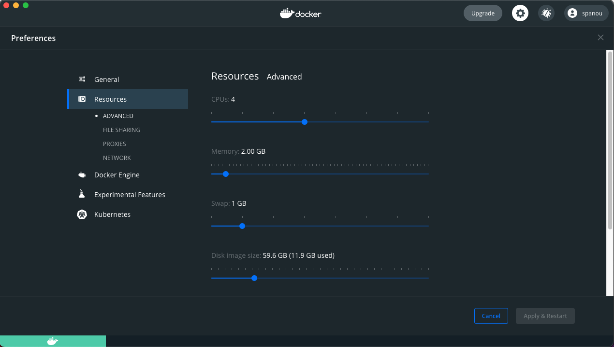

# Baremetal Super Minimal

- [Home](../README.md)
	+ [Step 1 - Installing The Tools](#step-1---installing-the-tools)
		* [Prerequisites](#prerequisites)
		* [Launching The Container](#launching-the-container)
		* [Testing The Container Setup](#testing-the-container-setup)
	+ [Step 2 - Clone & Build the Code](#step-2---clone--build-the-code)
		* [Cloning the Git Repo](#cloning-the-git-repo)
		* [Building the Basic Example](#building-the-basic-example)
	+ [Step 3 - Load, Debug & Run The Code](#step-3---load-debug--run-the-code)
		* [Launching QEMU With the Example](#launching-qemu-with-the-example)
		* [Setting a Breakpoint & Running to It](#setting-a-breakpoint--running-to-it)
		* [Quiting QEMU & Cleaning Up](#quiting-qemu--cleaning-up)
	+ [Next Steps](#next-steps)


## Step 1 - Installing The Tools

### Prerequisites

Before being able to use our docker image we are assuming the following prerequisites have been met.

- You have a working docker desktop installed and running, if not please visit this docker [here](https://docs.docker.com/desktop/)
- Your host has at least 2GB of free disk space
- You are somewhat familiar with QEMU and the GCC ARM toolchain.
- _(Optional)_ If you are running on Windows or Mac it will be good if you can increase the resources through the settings found in ```Docker -> Preferences```. See screenshot below: 

**Baremetal Super Minimal** is a project that enables you to learn embedded programming on the popular ARM Cortex M cores from the ground up. All the tools we will use are completely open source and at no cost _(you don't need a board to get started)_. We will not use vendor tools, ever. 


### Launching The Container

1. Open your console/terminal window. The command in (2) below assumes there is a directory in your host machine’s $HOME directory called ```development/```. If not please create one with ```mkdir $HOME/development```

2. Once your development directory is created type the following: 
```bash
docker run -it --rm --privileged --name qemu-m4 --hostname=qemu-m4 --mount type=bind,source="$HOME"/development,target=/home/spanou/development spanou/qemu-m4:latest
```

### Testing The Container Setup

Once you have launched the container you should be able to find yourself in the prompt ```spanou@qemu-m4:~$```. Effectively at this point, you have access to the container, you can be sure it is up and running.

Let's check QEMU is up and running, in your prompt type ```qemu-system-arm --version``` the following should appear on your console:

```bash
spanou@qemu-m4:~$ qemu-system-arm --version
QEMU emulator version 7.1.50 (v7.1.0-748-gf1d33f55c4)
Copyright (c) 2003-2022 Fabrice Bellard and the QEMU Project developers
spanou@qemu-m4:~$ 
```

Next let's make sure our development toolchain is installed properly, on your console type ```arm-none-eabi-``` and then press tab twice, the following list of options will appear:

```bash
spanou@qemu-m4:~$ arm-none-eabi-
arm-none-eabi-addr2line   arm-none-eabi-c++filt     arm-none-eabi-gcc         arm-none-eabi-gcc-ranlib  arm-none-eabi-gprof       arm-none-eabi-objcopy     arm-none-eabi-size        
arm-none-eabi-ar          arm-none-eabi-cpp         arm-none-eabi-gcc-7.3.1   arm-none-eabi-gcov        arm-none-eabi-ld          arm-none-eabi-objdump     arm-none-eabi-strings     
arm-none-eabi-as          arm-none-eabi-elfedit     arm-none-eabi-gcc-ar      arm-none-eabi-gcov-dump   arm-none-eabi-ld.bfd      arm-none-eabi-ranlib      arm-none-eabi-strip       
arm-none-eabi-c++         arm-none-eabi-g++         arm-none-eabi-gcc-nm      arm-none-eabi-gcov-tool   arm-none-eabi-nm          arm-none-eabi-readelf   
```

Now let's check the GCC version by typing ```arm-none-eabi-gcc --version```, the following should appear on your console:
```bash
spanou@qemu-m4:~$ arm-none-eabi-gcc --version
arm-none-eabi-gcc (15:7-2018-q2-6) 7.3.1 20180622 (release) [ARM/embedded-7-branch revision 261907]
Copyright (C) 2017 Free Software Foundation, Inc.
This is free software; see the source for copying conditions.  There is NO
warranty; not even for MERCHANTABILITY or FITNESS FOR A PARTICULAR PURPOSE.

spanou@qemu-m4:~$ 
```

At this point we know that both the toolchain and qemu is accessible to us, now let's see how to run QEMU, please note QEMU has a considerable amount of options, covering here is not in scope of this project. I would strongly encourage to you go to the qemu website for those.

_**Keep your console up and running for the next step.**_


## Step 2 - Clone & Build the Code

### Cloning the Git Repo

1. While your container is up and running and you have access to its consoler from the previous step, go ahead and type the following:

```bash
cd development/ 
git clone https://github.com/spanou/baremetal-super-minimal.git
```

2. The following should appear on your screen: 
```bash
spanou@qemu-m4:~/development$ git clone https://github.com/spanou/baremetal-super-minimal.git
Cloning into 'baremetal-super-minimal'...
remote: Enumerating objects: 62, done.
remote: Counting objects: 100% (62/62), done.
remote: Compressing objects: 100% (48/48), done.
remote: Total 62 (delta 27), reused 34 (delta 11), pack-reused 0
Unpacking objects: 100% (62/62), done.
```

### Building the Basic Example

1. Jump into the cloned directory by typing: 

```bash
spanou@qemu-m4:~/development$ cd baremetal-super-minimal/
```
TODO: Make sure you check out the right tag first


2. Build the basic example by typing: 
```bash 
spanou@qemu-m4:~/development/baremetal-super-minimal$ make all
arm-none-eabi-gcc -g -I./src -I./include -mthumb -mcpu=cortex-m4 -nostdlib -nostartfiles -ffreestanding -c src/test.c -o src/test.o
arm-none-eabi-as -g -I./src -I./include src/consts.s -o src/consts.o
arm-none-eabi-as -g -I./src -I./include src/startup.s -o src/startup.o
arm-none-eabi-as -g -I./src -I./include src/vector_table.s -o src/vector_table.o
arm-none-eabi-ld src/test.o src/consts.o src/startup.o src/vector_table.o -nostartfiles  -o startup.elf -T linker.ld
arm-none-eabi-objcopy -O binary startup.elf startup.bin
arm-none-eabi-objdump -h -S startup.elf > startup.lst
arm-none-eabi-nm -l -n startup.elf >  startup.sym
spanou@qemu-m4:~/development/baremetal-super-minimal$ 
```

3. At this point you have a ```startup.elf``` that was build as part of the Makefile invocation, in addition you have a ```startup.lst```, ```startup.sym``` and ```startup.bin```. Don't worry about what all these files do yet, we'll explain each of those in our first tutorial. For now let's get the startup.bin file loaded in QEMU and started.

```bash
spanou@qemu-m4:~/development/baremetal-super-minimal$ ls -alh startup.*
-rwxr-xr-x 1 spanou root  564 Oct 23 19:04 startup.bin
-rwxr-xr-x 1 spanou root 3.1K Oct 23 19:04 startup.elf
-rw-r--r-- 1 spanou root 2.2K Oct 23 19:04 startup.lst
-rw-r--r-- 1 spanou root  516 Oct 23 19:04 startup.sym
```


## Step 3 - Load, Debug & Run The Code

At this step what we will do is to load the ```startup.bin``` in QEMU, attach the debugger, examine the target memory, run the example and then check the target memory for changes to verify our code run successfully. 


### Launching QEMU With the Example

1. To launch QEMU with the example, type the following on the same window as the previous step: 
```bash
spanou@qemu-m4:~/development/baremetal-super-minimal$ make run
qemu-system-arm -M netduinoplus2 -display none -S -s -serial none -serial none -serial mon:stdio  -kernel startup.bin &
```

2. Launch the Debugger and Wait

At this point we will launch the debugger and wait, we do so by typing the following: 
```bash 
spanou@qemu-m4:~/development/baremetal-super-minimal$ gdb-multiarch startup.elf
```

The following will appear on your screen: 
```bash
GNU gdb (Debian 8.2.1-2+b3) 8.2.1
Copyright (C) 2018 Free Software Foundation, Inc.
License GPLv3+: GNU GPL version 3 or later <http://gnu.org/licenses/gpl.html>
This is free software: you are free to change and redistribute it.
There is NO WARRANTY, to the extent permitted by law.
Type "show copying" and "show warranty" for details.
This GDB was configured as "x86_64-linux-gnu".
Type "show configuration" for configuration details.
For bug reporting instructions, please see:
<http://www.gnu.org/software/gdb/bugs/>.
Find the GDB manual and other documentation resources online at:
    <http://www.gnu.org/software/gdb/documentation/>.

For help, type "help".
Type "apropos word" to search for commands related to "word"...
Reading symbols from startup.elf...done.
resetHandler () at src/startup.s:13
13	    B _start
Breakpoint 1 at 0x20a: file src/startup.s, line 16.
(gdb)
```

At this point QEMU has loaded the binary in the system, the debugger has attached and the program execution has stopped at line (16) right after the ```_start``` label


3. Let's check our source code, we do that by typing the following at the gdb prompt: 
```bash 
(gdb) list 1,100

```

What we should see immediately printed out is our source code: 
```bash 
(gdb) list 1,100
1	#
2	# Start Up Assembler to Learn GCC ASM for ARM M4
3	#
4	.syntax unified
5	.cpu cortex-m4
6	.thumb 
7	
8	.text
9	.global resetHandler
10	
11	.type resetHandler, %function
12	resetHandler:
13	    B _start
14	
15	_start:
16	    NOP @Do Nothing
17	    MRS R0, BASEPRI
18	    MRS R0, PRIMASK
19	    MRS R0, FAULTMASK
20	    MRS R0, PSR
21	    MRS R0, CONTROL
22	    LDR R0, ='H'
23	    LDR R1, ='e'
24	    LDR R2, ='l'
25	    LDR R3, ='l'
26	    LDR R4, ='o'
27	    LDR R5, =' '
28	    LDR R6, = 'W'
29	    LDR R7, = 'o'
30	    LDR R8, = 'r'
31	    LDR R9, = 'l'
32	    LDR R10, = 'd'
33	    _endlessLoop:
34	    NOP
35	    B _endlessLoop
36
(gdb) 
```

### Setting a Breakpoint & Running to It

4. Effectively at this point our code is loaded and ready to run, let's try a couple of things before we go forward. Let's try to put a breapoint on line 34, we do so by typing the following: 

```bash
(gdb) b 34
Breakpoint 2 at 0x24e: file src/startup.s, line 35.
(gdb) 
```

As you can see the debugger has now placed a break on line 24. The info message shows us the following:
- ```Breakpoint 2``` - This breakpoint is now associated with number 2, as in the second breakpoint.
- ```at 0x24e``` - The location of the PC (Program Counter) for that specific code line 
- ```file src/startup.s ``` - The file for which this breakpoint corresponds to 
- ``` line 35 ``` - The line in ```src/startup.s``` which this breakpoint corresponds to. 

5. Let's examine the values of our registers before we run the program, we do so by typing the following: 
```
(gdb) info registers
r0             0x0                 0
r1             0x0                 0
r2             0x0                 0
r3             0x0                 0
r4             0x0                 0
r5             0x0                 0
r6             0x0                 0
r7             0x0                 0
r8             0x0                 0
r9             0x0                 0
r10            0x0                 0
r11            0x0                 0
r12            0x0                 0
sp             0x20000400          0x20000400
lr             0xffffffff          -1
pc             0x208               0x208 <resetHandler>
xpsr           0x41000000          1090519040
fpscr          0x0                 0
```
As you can see Registers R0 to R12 are zero'ed out. 


6. Now let's run the code until breakpoint #2 is hit. We do so by typing the following on the gdb prompt:
```bash
(gdb) c
Continuing.

Breakpoint 1, _start () at src/startup.s:16
16	    NOP @Do Nothing
(gdb) c
Continuing.

Breakpoint 2, _endlessLoop () at src/startup.s:35
35	    B _endlessLoop
```
You'll see from the above we had to hit 'c' twice to get us to the second breakpoint. 

6. The startup.s application does something very simple, it loads the character string 'Hello World' in the R0 to R10 registers, leaving R11, and R12 untouched before it goes into an endless loop. So let's examine the registers to see if they are the right values after execution and before hiting the endlessLoop section. We do so by typing the following: 

```bash
(gdb) info registers
r0             0x48                72
r1             0x65                101
r2             0x6c                108
r3             0x6c                108
r4             0x6f                111
r5             0x20                32
r6             0x57                87
r7             0x6f                111
r8             0x72                114
r9             0x6c                108
r10            0x64                100
r11            0x0                 0
r12            0x0                 0
sp             0x20000400          0x20000400
lr             0xffffffff          -1
pc             0x24e               0x24e <_endlessLoop+2>
xpsr           0x41000000          1090519040
fpscr          0x0                 0
(gdb) 
```

If you look carefull you will see that: 
```bash
R0 == 0x48 == 'H'
R1 == 0x65 == 'e'
R2 == 0x6c == 'l'
R3 == 0x6c == 'l'
R4 == 0x6f == 'o'
R5 == 0x20 == ' '
R6 == 0x57 == 'W'
R7 == 0x6f == 'o'
R8 == 0x72 == 'r'
R9 == 0x6c == 'l'
R10== 0x64 == 'd'
```

### Quiting QEMU & Cleaning Up
7. Now that we have run our first example the next step is to quit GDB properly and clean up a bit after ourselves. On the gdb prompt type quit and press enter, when prompted press 'y' to quit.
```
A debugging session is active.

	Inferior 1 [process 1] will be detached.

Quit anyway? (y or n) y
Detaching from program: /home/spanou/development/baremetal-super-minimal/startup.elf, process 1
Ending remote debugging.
[Inferior 1 (process 1) detached]
```
At this point our debugger has been detached but our QEMU model is still running. Now lets terminate QEMU by typing the following: 
```
spanou@qemu-m4:~/development/c/test/baremetal-super-minimal$ ps -a
  PID TTY          TIME CMD
   39 pts/0    00:00:59 qemu-system-arm
   44 pts/0    00:00:00 ps
```

This command gives us the Process ID for QEMU, in this example it is 39. In your example this number might/will be different, make sure you select the process ID (PID) number corresponding to your ```qemu-system-arm``` executable. We are now goign to kill that process: 

```
spanou@qemu-m4:~/development/baremetal-super-minimal$ kill -9 39
spanou@qemu-m4:~/development/baremetal-super-minimal$ ps -a
  PID TTY          TIME CMD
   45 pts/0    00:00:00 ps
spanou@qemu-m4:~/development/baremetal-super-minimal$
```
As you can see after the ```kill -9 30``` if we examine the running processes again, ```qemu-system-arm``` is not longer there! 

## Next Steps

Although not a terribly exciting example, a lot has happened behind the scenes to get us even to this point, don't worry if you don't understand everything just yet. The point of this Getting Started guide is to ensure everything works on your setup and to expose you to some very basic concepts. We will cover everything in detail in [Tutorial #1](). 
