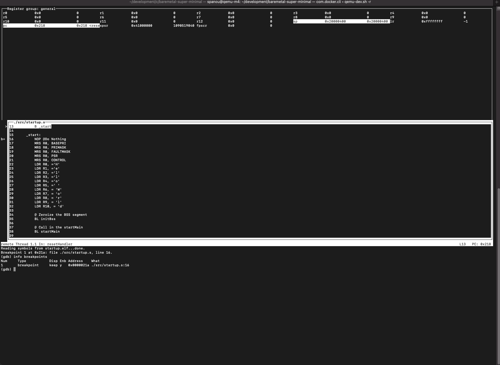
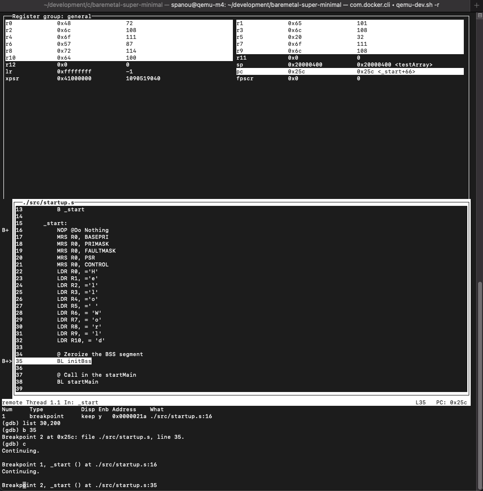

# Baremetal Super Minimal

- [Home](../README.md)
	+ [Step 1 - Installing The Tools](#step-1---installing-the-tools)
		* [Prerequisites](#prerequisites)
		* [Launching The Container](#launching-the-container)
		* [Testing The Container Setup](#testing-the-container-setup)
	+ [Step 2 - Clone & Build the Code](#step-2---clone--build-the-code)
		* [Cloning the Git Repo](#cloning-the-git-repo)
		* [Building the Basic Example](#building-the-basic-example)
	+ [Step 3 - Load, Debug & Run The Code](#step-3---load-debug--run-the-code)
		* [Launching QEMU With the Example](#launching-qemu-with-the-example)
		* [Setting a Breakpoint & Running to It](#setting-a-breakpoint--running-to-it)
		* [Quiting QEMU & Cleaning Up](#quiting-qemu--cleaning-up)
	+ [Next Steps](#next-steps)


## Step 1 - Installing The Tools

### Prerequisites

Before being able to use our docker image we are assuming the following prerequisites have been met.

- You have a working docker desktop installed and running, if not please visit this docker [here](https://docs.docker.com/desktop/)
- Your host has at least 2GB of free disk space
- You are somewhat familiar with QEMU and the GCC ARM toolchain.
- _(Optional)_ If you are running on Windows or Mac it will be good if you can increase the resources through the settings found in ```Docker -> Preferences```. See screenshot below: 

**Baremetal Super Minimal** is a project that enables you to learn embedded programming on the popular ARM Cortex M cores from the ground up. All the tools we will use are completely open source and at no cost _(you don't need a board to get started)_. We will not use vendor tools, ever.


### Launching The Container

1. Open your console/terminal window. The command in (2) below assumes there is a directory in your host machine’s $HOME directory called ```development/```. If not please create one with ```mkdir $HOME/development```

2. Once your development directory is created type the following:
```bash
docker run -it --rm --privileged --name qemu-m4 --hostname=qemu-m4 --mount type=bind,source="$HOME"/development,target=/home/spanou/development spanou/qemu-m4:latest
```

### Testing The Container Setup

Once you have launched the container you should be able to find yourself in the prompt ```spanou@qemu-m4:~$```. Effectively at this point, you have access to the container, you can be sure it is up and running.

Let's check QEMU is up and running, in your prompt type ```qemu-system-arm --version``` the following should appear on your console:

```bash
spanou@qemu-m4:~$ qemu-system-arm --version
QEMU emulator version 7.1.50 (v7.1.0-748-gf1d33f55c4)
Copyright (c) 2003-2022 Fabrice Bellard and the QEMU Project developers
spanou@qemu-m4:~$
```

Next let's make sure our development toolchain is installed properly, on your console type ```arm-none-eabi-``` and then press tab twice, the following list of options will appear:

```bash
spanou@qemu-m4:~$ arm-none-eabi-
arm-none-eabi-addr2line   arm-none-eabi-c++filt     arm-none-eabi-gcc         arm-none-eabi-gcc-ranlib  arm-none-eabi-gprof       arm-none-eabi-objcopy     arm-none-eabi-size
arm-none-eabi-ar          arm-none-eabi-cpp         arm-none-eabi-gcc-7.3.1   arm-none-eabi-gcov        arm-none-eabi-ld          arm-none-eabi-objdump     arm-none-eabi-strings
arm-none-eabi-as          arm-none-eabi-elfedit     arm-none-eabi-gcc-ar      arm-none-eabi-gcov-dump   arm-none-eabi-ld.bfd      arm-none-eabi-ranlib      arm-none-eabi-strip
arm-none-eabi-c++         arm-none-eabi-g++         arm-none-eabi-gcc-nm      arm-none-eabi-gcov-tool   arm-none-eabi-nm          arm-none-eabi-readelf
```

Now let's check the GCC version by typing ```arm-none-eabi-gcc --version```, the following should appear on your console:
```bash
spanou@qemu-m4:~$ arm-none-eabi-gcc --version
arm-none-eabi-gcc (15:7-2018-q2-6) 7.3.1 20180622 (release) [ARM/embedded-7-branch revision 261907]
Copyright (C) 2017 Free Software Foundation, Inc.
This is free software; see the source for copying conditions.  There is NO
warranty; not even for MERCHANTABILITY or FITNESS FOR A PARTICULAR PURPOSE.

spanou@qemu-m4:~$
```

At this point we know that both the toolchain and qemu is accessible to us, now let's see how to run QEMU, please note QEMU has a considerable amount of options, covering here is not in scope of this project. I would strongly encourage to you go to the qemu website for those.

_**Keep your console up and running for the next step.**_


## Step 2 - Clone & Build the Code

### Cloning the Git Repo

1. While your container is up and running and you have access to its console from the previous step, go ahead and type the following:

```bash
cd development/
git clone https://github.com/spanou/baremetal-super-minimal.git
```

2. The following should appear on your screen:
```bash
spanou@qemu-m4:~/development$ git clone https://github.com/spanou/baremetal-super-minimal.git
Cloning into 'baremetal-super-minimal'...
remote: Enumerating objects: 170, done.
remote: Counting objects: 100% (170/170), done.
remote: Compressing objects: 100% (116/116), done.
remote: Total 170 (delta 80), reused 127 (delta 46), pack-reused 0
Receiving objects: 100% (170/170), 1.33 MiB | 2.16 MiB/s, done.
Resolving deltas: 100% (80/80), done.
```
3. Move to the project directory & get some help 

Since everything (almost) in our project is driven through our Makefile, let's see what options we have. 
Go ahead and execute the followign commands:
```bash
spanou@qemu-m4:~/development$ cd baremetal-super-minimal/
spanou@qemu-m4:~/development/baremetal-super-minimal$ make help
==========================================================================================
Usage:

 make <options> <target>

  options: BOARD=[qemu|sam4] BUILD=[debug|release]

      BOARD= 
          qemu    -> build for a QEMU\'s Netduino Plus 2 Virtual Board (default)
          sam4    -> build for a SAM4 XPlained Pro Board
      BUILD= 
          dev     -> development build: all debug symbols are in, drops optimization to 0
          rel     -> release build: no debug symbols, full on optimization

  target: [all|debug|clean|rebuild|help]

     all     -> builds all artifacts such as the *.elf, *.bin, *.sym and *.lst files
     debug   -> loads the executable binary and attaches the debugger
     clean   -> removes all build artifacts inlcuding object files
     rebuild -> removes all build artifacts and rebuilds the from scratch
     help    -> prints this message
==========================================================================================
spanou@qemu-m4:~/development/baremetal-super-minimal$ 
```

The ```make help``` command shows us the above help, by default every build has BOARD=qemu and BUILD=dev and target is set by default to **all**, thereby we don't need to type that every time. Effectively our project supports the QEMU Netduino Plus 2 Virtual Board as well as the SAM4 XPlained Pro. Each project can be build either for development or for release. 

### Building the Basic Example

1. Build the basic example by typing:
```bash
spanou@qemu-m4:~/development/baremetal-super-minimal$ make 
===========================================================================================
 Build Date : Fri 11 Nov 2022 08:43:10 PM PST
 Project    : BareMetal Super Minimal
 Board      : qemu
 Build      : dev

 For Help type 'make help'
-------------------------------------------------------------------------------------------
python3 scripts/regParser.py --output=c scripts/qemu.csv > include/qemu.h.inc
python3 scripts/regParser.py --output=s scripts/qemu.csv > include/qemu.s.inc
arm-none-eabi-as -g  -I./include --defsym PLATFORM=0 ./src/main.s -o obj/main.o
arm-none-eabi-as -g  -I./include --defsym PLATFORM=0 ./src/consts.s -o obj/consts.o
arm-none-eabi-as -g  -I./include --defsym PLATFORM=0 ./src/startup.s -o obj/startup.o
arm-none-eabi-as -g  -I./include --defsym PLATFORM=0 ./src/vector_table.s -o obj/vector_table.o
arm-none-eabi-gcc -g -O0  -I./include -mthumb -mcpu=cortex-m4 -nostdlib -nostartfiles -ffreestanding -fno-common -DPLATFORM=0 -c ./src/test.c -o obj/test.o
arm-none-eabi-ld ./obj/main.o ./obj/consts.o ./obj/startup.o ./obj/vector_table.o ./obj/test.o -nostartfiles -o startup.elf -T linker.ld
arm-none-eabi-objcopy -O binary startup.elf startup.bin
arm-none-eabi-objdump -h -S startup.elf > startup.lst
arm-none-eabi-nm -l -n startup.elf > startup.sym
arm-none-eabi-size -t -x -A --common startup.elf
startup.elf  :
section            size         addr
.text             0x2c0          0x0
.data             0x400   0x20000000
.bss              0x190   0x20000400
.ARM.attributes    0x2f          0x0
.comment           0x57          0x0
.debug_line       0x127          0x0
.debug_info       0x11c          0x0
.debug_abbrev      0xba          0x0
.debug_aranges     0x60          0x0
.debug_str        0x156          0x0
.debug_frame       0x38          0x0
*COM*               0x0          0x0
Total             0xdc1


===========================================================================================
spanou@qemu-m4:~/development/baremetal-super-minimal$
```

2. At this point you have a ```startup.elf``` that was build as part of the Makefile invocation, in addition you have a ```startup.lst```, ```startup.sym``` and ```startup.bin```. Don't worry about what all these files do yet, we'll explain each of those in our first tutorial. For now let's get the startup.bin file loaded in QEMU and started.

```bash
spanou@qemu-m4:~/development/baremetal-super-minimal$ ls -alh startup.*
-rwxr-xr-x 1 spanou root  564 Oct 23 19:04 startup.bin
-rwxr-xr-x 1 spanou root 3.1K Oct 23 19:04 startup.elf
-rw-r--r-- 1 spanou root 2.2K Oct 23 19:04 startup.lst
-rw-r--r-- 1 spanou root  516 Oct 23 19:04 startup.sym
```


## Step 3 - Load, Debug & Run The Code

At this step what we will do is to load the ```startup.bin``` in QEMU, attach the debugger, examine the target memory, run the example and then check the target memory for changes to verify our code run successfully.


### Launching QEMU With the Example

1. To launch QEMU with the example, type the following on the same window as the previous step:
```bash
spanou@qemu-m4:~/development/baremetal-super-minimal$ make debug

```
The following will appear on your screen:


At this point QEMU has loaded the binary in the system, the debugger has attached and the program execution has stopped at line (16) right after the ```_start``` label

### Setting a Breakpoint & Running to It

1. Let's try a couple of things before we go forward. Let's try to put a breakpoint on ```line 35```, we do so by typing the following:

```bash
(gdb) b 35
Breakpoint 2 at 0x25c: file ./src/startup.s, line 35.
```


As you can see the debugger has now placed a break on line 35. The info message shows us the following:
- ```Breakpoint 2``` - This breakpoint is now associated with number 2, as in the second breakpoint.
- ```at 0x25c``` - The location of the PC (Program Counter) for that specific code line
- ```file src/startup.s ``` - The file for which this breakpoint corresponds to
- ``` line 35 ``` - The line in ```src/startup.s``` which this breakpoint corresponds to.

If you look at the top pane where the registers values are printed out you will see that Registers R0 to R12 are zero'ed out.


2. Now let's run the code until breakpoint #2 is hit. We do so by typing the following on the gdb prompt:
```bash
(gdb) c
Continuing.

Breakpoint 1, _start () at ./src/startup.s:16
```
As you can see we stoped at line 16, right at the ```NOP @Do Nothing``` instruction, now lets press `c` to continue again.
```bash
(gdb) c
Continuing.

Breakpoint 2, _start () at ./src/startup.s:35
```

3. The startup.s application does something very simple, it loads the character string 'Hello World' in the R0 to R10 registers, leaving R11, and R12 untouched. So let's examine the registers to see if they are the right values after execution. As you can see GDB has highlighted all the values that changed since the first breakpoint was hit.



If you look carefully you will see that:
```bash
R0 == 0x48 == 'H'
R1 == 0x65 == 'e'
R2 == 0x6c == 'l'
R3 == 0x6c == 'l'
R4 == 0x6f == 'o'
R5 == 0x20 == ' '
R6 == 0x57 == 'W'
R7 == 0x6f == 'o'
R8 == 0x72 == 'r'
R9 == 0x6c == 'l'
R10== 0x64 == 'd'
```

### Quiting QEMU
1. This is a simple step, just press q at the GDB prompt and then follow the instructions.

## Next Steps

Although not a terribly exciting example, a lot has happened behind the scenes to get us even to this point, don't worry if you don't understand everything just yet. The point of this Getting Started guide is to ensure everything works on your setup and to expose you to some very basic concepts. We will cover everything in detail in [The Basics](./the-basics.md).
