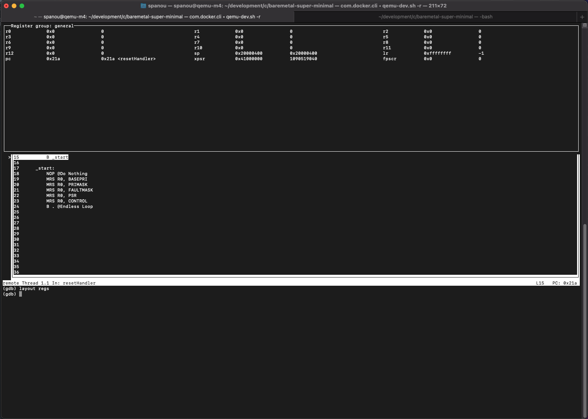

# Running on QEMU

__Author:__ Sakis Panou <sakis.panou@gmail.com>

__Date:__ Sat 25 Sep 2021

__Markdown Rules:__ [here](https://www.markdownguide.org/basic-syntax/)

ARM ASM Tutorial
[here](https://www.mikrocontroller.net/articles/ARM-ASM-Tutorial)
A PDF of the page above can be found [here](./ARM-ASM-Tutorial.pdf)
***

## Debuggging with the Makefile

```bash
make run
gdb-multiarch startup.elf
```
**Note**: One of the reasons you don't need to specify the remote target when loading
is due to the ```.gdbinit``` which is getting loaded when the call to the gdb-multiarch is made. The content of the .gdbinit are as follows:
```
add-auto-load-safe-path /home/spanou/development/sam4-xplainpro/bluepin_asm/.gdbinit
set architecture arm
target remote localhost:1234
```

### Make sure you kill QEMU after you done debugging
```
  spanou@qemu-m4:~/development/c/baremetal-super-minimal$ ps -a
  PID TTY          TIME CMD
  329 pts/0    00:00:00 qemu-system-arm
  332 pts/0    00:00:00 ps
spanou@qemu-m4:~/development/c/baremetal-super-minimal$ kill -9 329
spanou@qemu-m4:~/development/c/baremetal-super-minimal$ ps -a
  PID TTY          TIME CMD
  333 pts/0    00:00:00 ps
spanou@qemu-m4:~/development/c/baremetal-super-minimal$ 
```
***


## GDB Layouts
- `(gdb) help layouts`  _outputs a list of layouts, see below for options._

__Example:__

```
(gdb) help layout

Change the layout of windows.

Usage: layout prev | next | LAYOUT-NAME

Layout names are:

  src   : Displays source and command windows.

  asm   : Displays disassembly and command windows.
  split : Displays source, disassembly and command windows.
  regs  : Displays register window. If existing layout
          is source/command or assembly/command, the
          register window is displayed. If the
          source/assembly/command (split) is displayed,
          the register window is displayed with
          the window that has current logical focus.
```
From the gdb prompt type:
```
(gdb) layout src
(gdb) layout regs
```

The output should be something like what's shown in the _figure 1_ below.



_figure 1_ - gdb layout example


***

