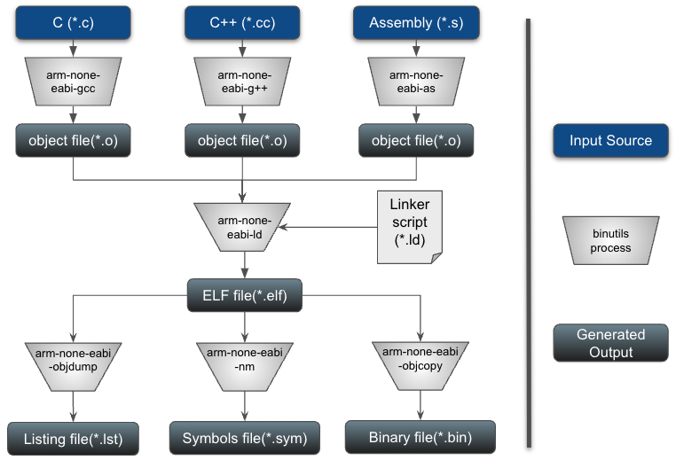

# The Basics - Making Sense Of It All! [DRAFT]

In our [Getting Started Example](./getting-started.md) we skipped over many things that happened in the background. In this tutorial we will go over all of the step by step.

- [Home](../README.md)
	+ [Getting to know your tools]()
		- [Build Tools](#your-build-system)
			+ [Assember]()
			+ [Compilers]()
			+ [Linker]()
			+ [Object Dumps]()
			+ [Symbol Lists]()
			+ [ELF Reader]()
		- [Makefile](#the-makefile)
		- [Version Control](#version-control)
		- [Scripts](#scripts)
		- [Docker](#docker)
		- [Documents](#documents)
		- [Additional Resources](#additional-resources)

## Getting to Know Your Tools

Knowing your tools makes the difference between being able to do high precision, high volume work, and trying things at the worst possible time. Like every professional, your tools are one of your most valuable resource. You don't need to become an expert straight away, we will add to our knowledge in every tutorial.

In this chapter we will go over all the tools we are using, we'll dive deep where we need to, and as we go along, in every tutorial, we'll add a bit more to your knowledge.


### The Build Tools

To build an embedded application, we need the right tools for the specific **Target Machine**. We cannot simply use the same tools _(complier, linker..etc)_ that we use for our x86_64 **Host Machine**. We need a set of tools that will compile and link code for the specific **Target Machine**.

Let's get some basic terminology down quickly. Your **Target Machine** is the embedded system for which your code is built and run, it can be an ARM32 core, ARM64, RISC-V...etc. In contrast your **Host Machine** is the laptop/workstation/desktop that you use to build the code for your Target Machine. _Figure 1_ below shows a visual representation of a typical embedded development setup.


_Figure 1 - Common Embedded Development Set Up_

To build code for a **Target Machine**, which is typically different from your **Host Machine**, it is important to install a **cross compilation toolchain**. Thankfully many of these cross compilation tool chains are pre-built and ready to install. They support a variety of popular Host Machine OSes _(Linux, Mac, Windows)_.

> **Note**: The collection of those tools is commonly referred to as **binutils** _(at least in GNU parlance)_.

There are many suppliers of cross complication tool chains, we will focus on the GNU ones. This is in keeping with making sure we use popular free open source tools.

Build Tools come in many flavours for many Target Machines. The GNU build system supports the concept of a [Target Triplet](https://wiki.osdev.org/Target_Triplet). It is called a triplet because the build system name is comprised of 3 key pieces of information. Those are:

```
[MACHINE]-[VENDOR]-[OPERATING-SYSTEM]

MACHINE = x86_64, ARM, RISCV...etc
VENDOR  = pc, unknown, none...etc
OS      = linux,freebsd, eabi...etc
```

To determine what your compiler tool chain supports invoke the ```arm-none-eabi-gcc``` with the ```-dumpmachine``` parameter.

> **Note**: At this point we expect you to have your docker container with its console/terminal available to you. If you don't recall how please look back at [Launching The Container](./getting-started.md#launching-the-container)

```
spanou@qemu-m4:~/development/baremetal-super-minimal$ arm-none-eabi-gcc -dumpmachine
arm-none-eabi
spanou@qemu-m4:~/development/baremetal-super-minimal$
```

Unsurprisingly, your compiler reports that your triplet is ```arm-none-eabi```. In other words we can build executables for an ARM 32 MCU, the vendor is none (independent) and the OS is the EABI which stands for [Embedded Application Binary Interface](https://en.wikipedia.org/wiki/Application_binary_interface#Embedded_ABIs).

In this tutorial we strongly suggest using the cross compilation tool chain that we have pre-installed in the Docker container image. Especially since our focus is on code development itself. There could be many reasons as to why you might want to control the build of your cross compilation tool chain from source. If you were building for a highly secure or safety sensitive system, you'll want to know the precise version of the tool chain, including any patches that are fixing critical issues. There are many ways to build your development tool chain from source, [crosstool-ng](https://crosstool-ng.github.io/), [yocto](https://www.yoctoproject.org/), or right from GCC source to mention a few. All these concepts are beyond the scope of this tutorial.

Your tool chain is comprised of a lot more than your compiler, linker, assembler. You need a whole collection of tools to help you when you develop for an embedded system.

#### Build Flow

A typical build flow consists of the following steps, shown in _Figure 2_.



_Figure 2 - Typicall Build Flow_

1. **Compile Source Code**
	+ _Pass the Sources (\*.c, \*.cc, \*.s) to the Compilers (C, C++, ASM) to generate the Object files (\*.o)_
2. **Build ELF by Link Object Files**
	+ _Pass the Object files (\*.o) to the Linker along with a linker script (\*.ld) to build the ELF file (\*.elf)_
3. **Generate The Listing**
	+ Pass the ELF file to the Object Dump (objdump) utility to generate a listing file (\*.lst) which contains the source code and dissably for all sources
4. **Generate The Binary**
	+ _Pass the ELF file to the Object Copy (objcopy) utility to generate a binary file (\*.bin) that will be loaded in the target's executable memory_
5. **Generate the Symbols**
	+ _Pass the ELF file to the Name List (nm) utility to generate a list of all the symbols and their memory locations that got generated during the build process_

> **Note**: For the sake of clarity a few steps have been omitted from the diagram, we will look more into those as we take a deep dive into the Makefile

#### Binutils
In addition to the compilers, linkers, object copies, object dumps there are many many other binutils at your disposal for various usages. We'll give you links to all the manuals. Let's briefly look at some of them.

On your docker console type ```arm-none-eabi-``` and then press tab twice, the following list of options will appear:

```bash
spanou@qemu-m4:~$ arm-none-eabi-
arm-none-eabi-addr2line   arm-none-eabi-c++filt     arm-none-eabi-gcc         arm-none-eabi-gcc-ranlib  arm-none-eabi-gprof       arm-none-eabi-objcopy     arm-none-eabi-size
arm-none-eabi-ar          arm-none-eabi-cpp         arm-none-eabi-gcc-7.3.1   arm-none-eabi-gcov        arm-none-eabi-ld          arm-none-eabi-objdump     arm-none-eabi-strings
arm-none-eabi-elfedit     arm-none-eabi-gcc-ar      arm-none-eabi-gcov-dump   arm-none-eabi-ld.bfd      arm-none-eabi-ranlib      arm-none-eabi-strip
arm-none-eabi-c++         arm-none-eabi-g++         arm-none-eabi-gcc-nm      arm-none-eabi-gcov-tool   arm-none-eabi-nm          arm-none-eabi-readelf
```

- **[arm-none-eabi-objdump](https://manpages.debian.org/testing/binutils-arm-none-eabi/arm-none-eabi-objdump.1.en.html)**
	+ Enables us to display key information about object files. In our examples we'll be using objdump to create our ```*.lst``` files. The listing files contain our source code, for every source code line the equivalent disassembly is displayed. This is extremenly useful when debugging complex issues.

- **[arm-none-eabi-nm](https://manpages.debian.org/testing/binutils-arm-none-eabi/arm-none-eabi-nm.1.en.html)**
	+ Enables us to list symbols from object files. Effectively it allows us to dump all the symbols in our application, their types and their absolute locations. This can be particularly useful when we are hunting down information and debugging our code.

- **[arm-none-eabi-objcopy](https://manpages.debian.org/testing/binutils-arm-none-eabi/arm-none-eabi-objcopy.1.en.html)**
	+ Enables us to copy and translate object files. Effectively this utility allows us to extract the binary image of our application, the actual opcode and operants that will be programmed into our device's memory to execute right after reset.

- **[arm-none-eabi-size](https://manpages.debian.org/testing/binutils-arm-none-eabi/arm-none-eabi-size.1.en.html)**
	+ Enables us to list sections sizes and the total size of our binary file. This is particularly useful when we want to clearly know how much code space, data space we use in our embedded applications.

- **[arm-none-eabi-readelf](https://manpages.debian.org/testing/binutils-arm-none-eabi/arm-none-eabi-readelf.1.en.html)**
	+ Enables us to display key information about ELF (Executable & Linkable Format) files.

- **[arm-none-eabi-elfedit](https://manpages.debian.org/testing/binutils-arm-none-eabi/arm-none-eabi-elfedit.1.en.html)**
	+ Enables us to edit key information about ELF files.

- **[arm-none-eabi-strings](https://manpages.debian.org/testing/binutils-arm-none-eabi/arm-none-eabi-elfedit.1.en.html)**
	+ Enables us to print all strings contained within a file.

The full manuals for all the binutils can be found [here](https://manpages.debian.org/testing/binutils-arm-none-eabi/index.html)

#### ELF Files in Embedded Systems
> TODO:
> - Background history in ELF files
> - Outline basic content and how they were not designed for embedded systems.

## The Makefile
> TODO:
> - Comming Soon - Break down the current Makefile in depth.
> - Describe rules, Variables, Function - Basics in General, use the current content to reference these concepts.

## Version Control
> TODO:
> - Talk about git as a version management tool, its advantages and give open source resources to help.
> - Go through some very basic commands to help starting to build familiarity.

## Scripts
> TODO:
> - Go over the scripts we provide in our scripts folder and outline what they do.

## Docker
> TODO:
> - show how to have mulitiple docker console windows for the same docker container. Give details

## Additional Resources
### Documents
<TODO>
	
## Tutorials
Please access the tutorials [here](./tutorials.md).
