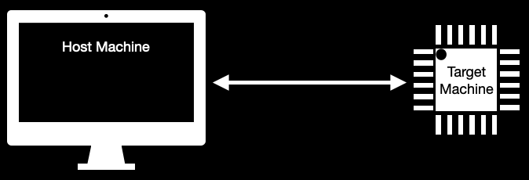

# Tutorial #01 - Making Sense Of It All! [DRAFT]

In our [Getting Started Example](./getting-started.md) we skipped over many things that happened in the background. In this tutorial we will go over all of the step by step.

- [Home](../README.md)


## Know Your Tools

Knowning your tools make the difference between success and aimlessly trying things at the worst possible time. Like every professional, your tools are the most valuable resource you have. Treat it well.

### Your Build System

**Cross Compilation Tool Chain**
To enable you to build code for a target machine that is different from your host machine it is important to install a cross compilation tool chain. Let's get some basic terminology down quickly. Your _target-machine_ is the embedded system for which your code is built and run, it can be an ARM32 core, ARM64, RISC-V...etc. In contrast your _host-machine_ is the laptop/workstation/desktop that you use to build the code for your _target-machine_. Thankfully many of these cross compilation tool chains are prebuild. Nowdays there is support for almost all of the popular OS'es such as Linux, Mac, Windows.



Compilers come in many flavours for many target-machines. The GNU build system supports the concept of a [Target Triplet](https://wiki.osdev.org/Target_Triplet). It is called a triplet because the build system name is comprised of 3 key pieces of information. Those are:

```
[MACHINE]-[VENDOR]-[OPERATING-SYSTEM]

MACHINE = x86_64, ARM, RISCV...etc
VENDOR  = pc, unknown, none...etc
OS      = linux,freebsd, eabi...etc
```

To determine what your compiler toolchain supports invoke the ```arm-none-eabi-gcc``` with the ```-dumpmachine``` parameter.

>Please Note: At this point we expect you to have your docker container with its console available to you. If you don't recall how please look back at [Launching The Container](./getting-started.md#launching-the-container)

```
spanou@qemu-m4:~/development/baremetal-super-minimal$ arm-none-eabi-gcc -dumpmachine
arm-none-eabi
spanou@qemu-m4:~/development/baremetal-super-minimal$
```

You can see that your compiler, unsurprisingly, reports that your triplet is ```arm-none-eabi```. In other words we can build executables for an ARM 32 CPU, the vendor is none (independent) and the OS is the EABI which stands for [Embedded Application Binary Interface](https://en.wikipedia.org/wiki/Application_binary_interface#Embedded_ABIs).

Your tool chain comprises of a lot more than your compiler, linker, assembler. You need a whole collection of tools to help you when you develop for an embedded system.

Let's briefly look at some of them, on your docker console type ```arm-none-eabi-``` and then press tab twice, the following list of options will appear:

```bash
spanou@qemu-m4:~$ arm-none-eabi-
arm-none-eabi-addr2line   arm-none-eabi-c++filt     arm-none-eabi-gcc         arm-none-eabi-gcc-ranlib  arm-none-eabi-gprof       arm-none-eabi-objcopy     arm-none-eabi-size
arm-none-eabi-ar          arm-none-eabi-cpp         arm-none-eabi-gcc-7.3.1   arm-none-eabi-gcov        arm-none-eabi-ld          arm-none-eabi-objdump     arm-none-eabi-strings
arm-none-eabi-as          arm-none-eabi-elfedit     arm-none-eabi-gcc-ar      arm-none-eabi-gcov-dump   arm-none-eabi-ld.bfd      arm-none-eabi-ranlib      arm-none-eabi-strip
arm-none-eabi-c++         arm-none-eabi-g++         arm-none-eabi-gcc-nm      arm-none-eabi-gcov-tool   arm-none-eabi-nm          arm-none-eabi-readelf
```

**arm-none-eabi-objdump**: a very useful application to allow you to display key information about many object files. In our examples we'll be using objdump to create our ```*.lst``` files. Checkout our startup.lst file to see what information we create. As our project expands we will be making more and more use of these files.

**arm-none-eabi-nm**: this utility allows us to dump all the symbols in our application, their types and their absolute locations in our application. This can be particularly useful when we are hunting down information and debugging our code.

**arm-none-eabi-objcopy**: this utility allows us to extract the binary image of our application, the actual opcode and operants that will be programmed into our device's memory to execute right after reset.


Perhaps it will be worth noting that during our build we'll be building an ELF file, it contains our applications image plus a lot more information about our build. ELF stands for _Executable and Linkable Format_, it is a format of an executable. It was not meant to be used in embedded systems, as such we need to post process the file in order to ensure it is suitable for an embedded environment. More on this later.

#### Summary

There are many ways to build your development tool chain, [crosstool-ng](https://crosstool-ng.github.io/), [yocto](https://www.yoctoproject.org/), or right from GCC to mention a few. There are legitimate reasons as to why you might want to control the build of your cross compilation tool chain. Imagine if you were building for a highly secure or safety sensitive system, you'll want to know the precise version of the tool chain, including any patches that are fixing critical issues, especially if your project needs to go through some certification. All these concepts are beyond the scope of this tutorial.